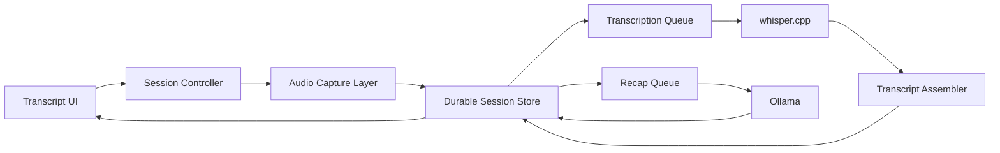

# Transcript and Recap Plan

## Goal

Add a local-first transcript and recap subsystem that can run on a reasonable modern PC, stays fully offline after models are installed, and survives interruptions without losing the whole session.

## What should be possible

- Start a transcript session with any of these source modes:
  - microphone only
  - system audio only
  - microphone + system audio together
- Keep microphone and system audio as distinct sources so the transcript and recap can tell where text came from.
- Show incremental transcript progress while the session is active.
- Halt capture/transcription intentionally without corrupting the session.
- Resume from the last good checkpoint after app crashes, device disconnects, or power loss.
- Re-run transcription for selected bad sections instead of redoing the entire session.
- Generate recaps locally from the transcript, both during long sessions and at the end.
- Offer model tiers so weaker PCs can still run the feature with smaller local models.
- Stay explicit about failures. If capture, model loading, or device access fails, that should be visible in the UI and logs, not silently ignored.

## Recommended systems

### 1. Session controller

The app should own a single session controller that starts, pauses, halts, resumes, and closes transcript sessions. It is the boundary between the UI and the background pipeline.

### 2. Audio capture layer

Use separate capture adapters per source type:

- Microphone capture for live user speech.
- System output capture for the audio currently being played by the OS.

Platform targets for the initial plan:

- Windows: use WASAPI loopback for system output capture.
- Linux: use PipeWire monitor/capture streams for system output capture.

The architecture should keep capture adapters isolated from the rest of the pipeline so platform-specific audio code does not leak into transcription or recap logic.

### 3. Durable session store

Each transcript session should be durable on disk from the start. The store should contain:

- raw captured audio in small committed pieces
- a session manifest that knows which pieces exist and what state each piece is in
- incremental transcript output
- recap checkpoints and final recap output
- device/source metadata and timestamps

This is the core protection against crashes and power loss.

### 4. Transcription engine

Use `whisper.cpp` as the transcription backend.

Why this fits:

- open source with an MIT license
- designed for local inference
- supports CPU-only inference
- supports optional acceleration when stronger hardware is available
- already includes a real-time microphone example and VAD support

The transcription engine should consume committed audio pieces from the durable store and produce transcript pieces, not one giant all-or-nothing output.

### 5. Transcript assembler

A transcript assembler should turn piece-level transcription into the user-facing transcript. It should preserve:

- source labels such as `mic` and `system`
- timestamps
- confidence or review markers where available
- session ordering across resumed runs

### 6. Recap engine

Use `Ollama` as the local recap runtime.

Why this fits:

- local model server with a stable local API
- available on Windows, Linux, and macOS
- open source with an MIT-licensed core repo
- lets the app stay model-agnostic while still using local LLMs

Recap should run from transcript data, not directly from raw audio. That keeps the recap layer simpler, cheaper, and easier to recover.

### 7. Local recap models

Use permissively licensed local instruct models served by Ollama. Good default families are:

- `qwen2.5` sizes that are Apache 2.0 licensed
- `SmolLM2`-class instruct models where Apache 2.0 packaging is available in the chosen runtime

Practical positioning:

- smaller models for always-available recap on modest CPUs
- mid-size models for better recap quality on stronger machines
- larger models optional, never required

Avoid custom-license or ambiguous-license models as defaults.

## How the systems interact

Operationally:

- capture writes durable audio pieces first
- transcription reads only committed pieces
- recap reads transcript pieces and recap checkpoints
- the UI reflects durable state instead of assuming in-memory state is trustworthy

## Halt and checkpoint behavior

The system should treat halt/recovery as a first-class requirement, not an afterthought.

### Halt behavior

When the user halts a session, the system should be able to:

- stop accepting new audio
- finalize the current in-progress capture piece
- preserve all already committed audio and transcript output
- leave unfinished work clearly marked as unfinished
- allow a later resume from the last valid checkpoint

### Crash and power-loss behavior

After an unexpected shutdown, the app should reopen the session by reading the durable session store and determining:

- which audio pieces were fully captured
- which pieces were already transcribed
- which pieces still need transcription
- which recap checkpoints are already valid

The recovery path should continue from the last known good state instead of restarting the session from zero.

### Long-session recap behavior

Recap must also be checkpointed. For long sessions, the system should maintain rolling recap state so the final recap does not depend on reprocessing the entire transcript in one pass.

## User-facing modes

The high-level feature set should support:

- live transcript mode
- record-now, transcribe-as-you-go mode
- stop-and-resume sessions
- transcript review and targeted re-transcription
- rolling recap during a session
- final recap at session end

## Hardware strategy

The baseline design should be CPU-first and GPU-optional.

That means:

- a modern multi-core CPU must be enough for a usable baseline experience
- stronger GPUs or NPUs should improve speed and model size options, but not be required
- the default model choices should prioritize predictable local performance over maximum benchmark quality

## Licensing and dependency guardrails

The default stack should stay inside permissive or otherwise low-friction licenses:

- `whisper.cpp`: MIT
- `Ollama`: MIT
- `PortAudio` if used for microphone abstraction: MIT
- `Qwen2.5` default recap sizes to prefer: Apache 2.0 variants
- `SmolLM2`: Apache 2.0

Storage and interchange should prefer plain, durable, low-risk formats such as:

- PCM WAV or FLAC for captured audio
- plain text plus structured metadata for transcript and recap state

Avoid making the initial design depend on copyleft-heavy codec stacks or cloud APIs.

## Scope recommendation

Initial scope should be:

- Windows and Linux support
- microphone capture
- system output capture
- durable checkpoints
- local transcription with `whisper.cpp`
- local recap with `Ollama`
- at least one small and one mid-size permissive recap model option

This is enough to deliver the core value without over-expanding into advanced features too early.

## Non-goals for the first version

These should not be required for the first pass:

- cloud transcription or cloud summarization
- dependency on a dedicated GPU
- complex speaker diarization
- backwards-compatibility shims for older storage layouts
- hidden fallback behavior

## Outcome

The end state should be a resilient local pipeline:

- audio comes in from microphone and/or system output
- audio is checkpointed immediately
- `whisper.cpp` turns checkpointed audio into a durable transcript
- `Ollama` turns the transcript and recap checkpoints into local recaps
- the session can be halted and resumed without losing the whole transcript

## Source notes

This plan is based on the current public docs for the recommended stack:

- `whisper.cpp` is MIT licensed, supports CPU-only inference, multiple platforms, and real-time audio input: <https://github.com/ggml-org/whisper.cpp>
- `Ollama` exposes a local API and supports Windows, Linux, and macOS: <https://docs.ollama.com/api/introduction> and <https://docs.ollama.com/quickstart>
- Windows system-output capture is supported through WASAPI loopback: <https://learn.microsoft.com/en-us/windows/win32/coreaudio/loopback-recording>
- PipeWire supports capture and monitor/loopback style audio routing on Linux: <https://docs.pipewire.org/page_module_loopback.html> and <https://docs.pipewire.org/page_man_pw-cat_1.html>
- PortAudio uses a plain MIT license: <https://portaudio.com/license.html>
- `qwen2.5` in Ollama documents Apache 2.0 licensing for all sizes except `3B` and `72B`: <https://ollama.com/library/qwen2.5>
- `SmolLM2` is published under Apache 2.0: <https://huggingface.co/HuggingFaceTB/SmolLM2-1.7B-Instruct>
